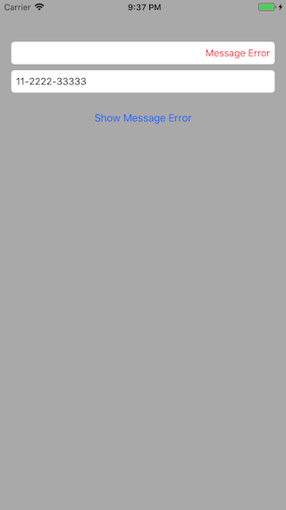

# RNMaskTextField
> It is a subclass of UITextfield to Provide the mask and message error label.





## Requirements

* iOS 8.0+ / Mac OS X 10.9+ / Apple TV 11
* Xcode 9.0+, Swift 4

## Adding RNMaskTextField to your project

<!--#### Carthage-->
<!---->
<!--1. Add `github "souzainf3/RNMaskTextField" "master"` to your Cartfile-->
<!--2. Run `carthage update` to clone & build the framework-->

#### Cocoapods

1. Add a pod entry for MaskTextField to your Podfile `pod 'RNMaskTextField'`
2. Install the pod(s) by running `pod install`.

#### Manually

1. Drag MaskTextField.swift and FormTextField.swift to your project

## Using RNMaskTextField

- Show a message of error in your TextField
```swift
self.textField.showAccessoryLabel(withText: "Message Error")
```

- Set a mask to your TextField
```swift
self.textField.textMask = "###.###"

/// Set the textField delegate and call the function shouldChangeCharacters(...)

extension ObjectObserver: UITextFieldDelegate {

func textField(_ textField: UITextField, shouldChangeCharactersIn range: NSRange, replacementString string: String) -> Bool {
return (textField as! MaskTextField).shouldChangeCharacters(in: range, replacementString: string)
}
}

```


### MaskTextField Properties

* Text Mask
```swift
textMask: String
```
*Default Char Mask
```swift
defaultCharMask: String = "#"
```

### FormTextField Properties

* Draw Text with edge insets. Default is .zero.
```swift
textEdgeInsets: UIEdgeInsets
```
*Accessory Font
```swift
accessoryFont: UIFont
```
*Accessory Text Color. Default is .red
```swift
accessoryTextColor: UIColor
```
* Shake AccessoryLabel when Showing text. Default is true
```swift
shakeAccessoryLabel : Bool
```
